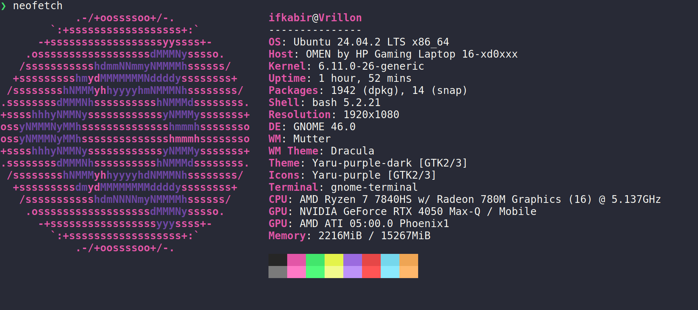

<pre style="font-family: monospace; color: #00FF00; background-color: #000000;">
  user@ishan:~$ ls -l
  total 4
  drwxr-xr-x 2 user user 4096 Oct 26 10:00 Projects
  user@ishan:~$ cd Projects
  user@ishan:~/Projects$ ./my_program
  Hello, World!
  user@ishan:~/Projects$
</pre>

---

🎓 I'm a Computer Science & Engineering student at **RGIPT**, passionate about building and exploring technology.  
Currently learning **C++**, **Linux**, and **development fundamentals**.

---

## 🔧 Tech Stack & Tools

---

## 🚀 Practice Grounds

---

## 🌱 Currently Working On

- Learning advanced Linux and systems programming  
- Strengthening DSA & C++  
- Exploring open-source contribution  
- Practicing CTFs

---

## 🖥️ Terminal Preview

> A peek into my Linux setup using neofetch 🌌

  

---

## 📫 Connect With Me

---

> ⚡ Thoughtfully built by Ishan

