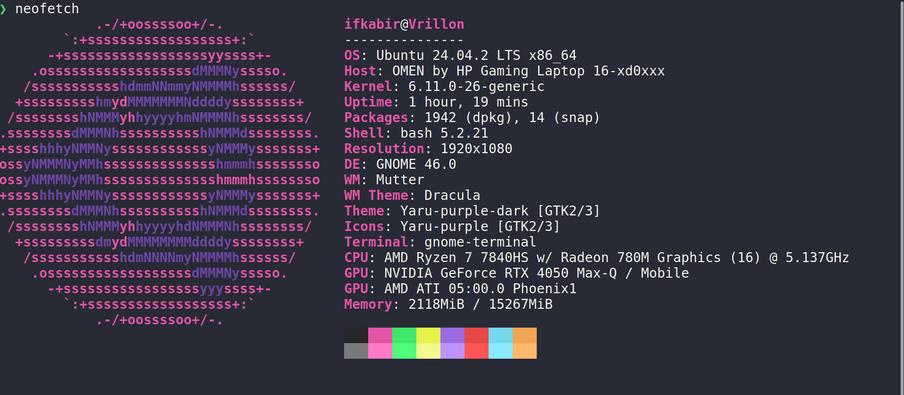

<!-- Dark Mode ASCII Art Banner -->

  

---

🎓 I'm a Computer Science student at **RGIPT**, passionate about building and exploring technology.  
Currently learning **C++**, **Linux**, and **development fundamentals**.

---

## 🔧 Tech Stack & Tools

---

## 🌱 Currently Working On

- Learning advanced Linux and systems programming  
- Building personal CLI tools and automation scripts  
- Exploring open-source contribution  
- Practicing CTFs

---

## 🖥️ Terminal Preview

> A peek into my Linux setup using `neofetch` 🌌

  

---

## 📫 Connect With Me

---

> ⚡ Thoughtfully built by Ishan

